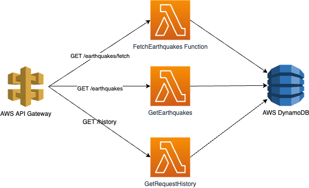

# Earthquakes

## High Level Solution Design

High Level Diagram


This repository uses Serverless Framework with AWS can supports offline mode to complete the solution at local environment.

## Getting Started
- Use the 16.x version of NodeJS framework by [NVM](https://github.com/nvm-sh/nvm)
```
nvm use 16
```

- Install Yarn
```
npm instal -g yarn typescript
```

- Install all node packages by yarn
```
yarn install
```

- Install [serverless framework](https://www.serverless.com/framework/docs/getting-started/)
```
npm install -g serverless
```

- Install dynamodb local for serverless
```
serverless dynamodb install
```

Caution: **The dynamodb local requires the machine has been installed [Java JRE](https://docs.oracle.com/javase/8/docs/technotes/guides/install/install_overview.html) > 8 to run**

- Start the serverless offline by

```
serverless offline start
```

- There are two ways to execute the API:

1. Import the postman configuration file to Postman and execute the collection API.
2. Uses CURL:
- Fetch earthquakes
```
curl --location --request GET 'http://localhost:3000/dev/earthquakes/fetch'
```
- Get earthquakes (Can add optional parameters: `limit` and `cursor`). `Cursor` is the `code` (this is primary key)
```
curl --location --request GET 'http://localhost:3000/dev/earthquakes'
```

- Get request history (Can add optional parameters: `limit` and `cursor`). `Cursor` is the `requestId` (this is primary key)
```
curl --location --request GET 'http://localhost:3000/dev/history'
```